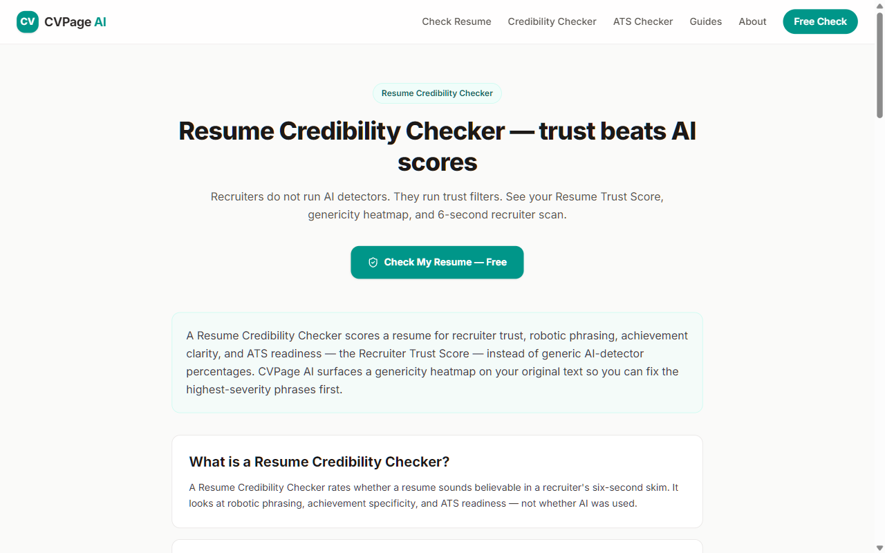
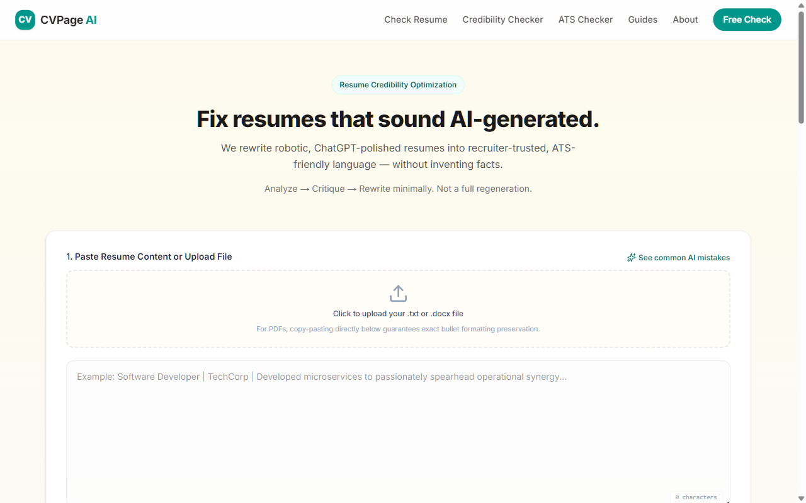
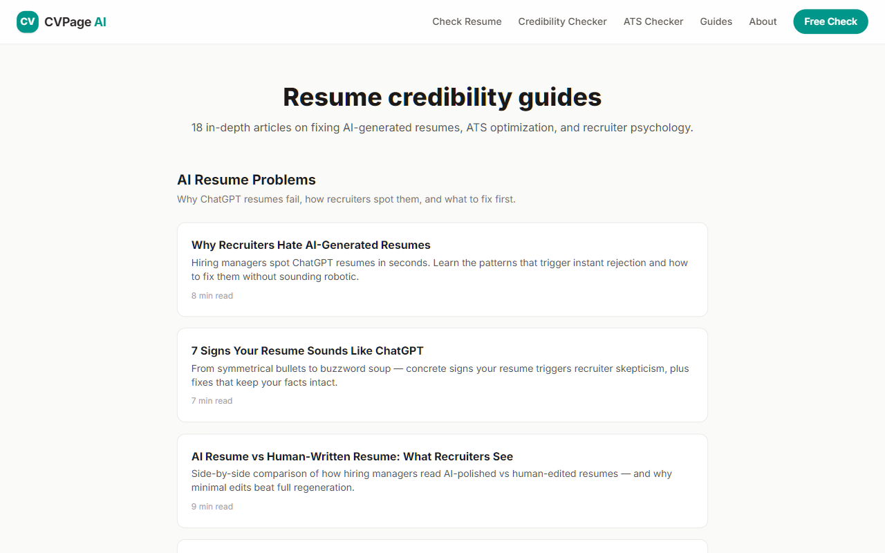

# Recruiter Resume Audit Framework

> A 5-step methodology recruiters use to decide in six seconds whether to read more — plus templates, checklists, and five fully worked audits you can copy.

Most resume advice is generic ("use action verbs"). This framework is **operational**: each step has pass/fail criteria, example flags, and rewrite guidance. Built from the same credibility rules used at [cvpage.org](https://cvpage.org).

Highly shareable on Reddit, career forums, and coach playbooks because it names *what recruiters actually do*, not what candidates wish they did.

## Downloads

- [Recruiter audit checklist (PDF, fillable)](downloads/recruiter-audit-checklist.pdf) — quick + deep checklists, 2 pages
- [Same checklist as Markdown](downloads/recruiter-audit-checklist.md)

## Live tool preview

The audit logic in this framework matches the production pipeline at [cvpage.org](https://cvpage.org):

---

## The 5 steps

| Step | Doc | Question it answers |
| --- | --- | --- |
| 1 | [Six-second scan](framework/01-six-second-scan.md) | Would I keep reading? |
| 2 | [Credibility checks](framework/02-credibility-checks.md) | Would I get caught lying in the phone screen? |
| 3 | [ATS pass](framework/03-ats-pass.md) | Will the system parse and match this? |
| 4 | [Impact vs activity](framework/04-impact-vs-activity.md) | Did they ship or just attend? |
| 5 | [Tone and voice](framework/05-tone-and-voice.md) | Does this sound human or ChatGPT? |

## Authority assets (citation-worthy)

| Asset | Purpose |
| --- | --- |
| [Scoring rubric](scoring/scoring-rubric.md) · [JSON](scoring/scoring-rubric.json) | 0–10 per dimension with anchors |
| [Aggregate formula](scoring/aggregate-formula.md) | Submit / fix first / block verdict |
| [Red-flag phrases](phrase-libraries/red-flag-phrases.md) · [JSON](phrase-libraries/red-flags.json) | Auto-fail phrase library |
| [Green-flag phrases](phrase-libraries/green-flag-phrases.md) | Trusted verbs and sentence shapes |
| [12 credibility heuristics](heuristics/credibility-heuristics.md) | Named rules with pass/fail tests |
| [Decision tree](heuristics/decision-tree.md) | Bullet-level credibility flowchart |

Run steps 1 → 5 in order. Step 2 is the highest-stakes for senior hires.

---

## Quick start

1. Print [quick-audit-checklist.md](checklists/quick-audit-checklist.md) — 10 minutes before you submit.
2. Use [audit-template.md](audits/audit-template.md) for a full pass on a friend's resume.
3. Read one [worked audit](audits/example-audits/) in your role family.

---

## Worked example audits

| Audit | Role | Top issue found |
| --- | --- | --- |
| [01 — Junior backend](audits/example-audits/01-junior-backend-audit.md) | Engineering | Scope inflation on intern bullets |
| [02 — Growth PM](audits/example-audits/02-growth-pm-audit.md) | Product | Invented 47% conversion lift |
| [03 — SDR](audits/example-audits/03-sdr-audit.md) | Sales | Vague pipeline language |
| [04 — Product designer](audits/example-audits/04-product-designer-audit.md) | Design | No named screens |
| [05 — RevOps](audits/example-audits/05-revops-audit.md) | Operations | Missing system names |

---

## Who this is for

- Job seekers self-auditing before apply
- Recruiters standardizing feedback language
- Career coaches running workshop exercises
- Hiring managers writing rubrics

---

## License

MIT. Fork freely; attribution appreciated.

<!-- FOOTER -->

<!-- ===== SHARED FOOTER — copy verbatim into the bottom of every repo README ===== -->

---

## Related repositories

Part of an open resource set for resume credibility, ATS, and recruiter-grade rewriting:

- [ai-resume-humanizer-prompts](https://github.com/Sahme115/ai-resume-humanizer-prompts) — prompt library for rewriting AI-sounding resumes
- [chatgpt-resume-before-after-examples](https://github.com/Sahme115/chatgpt-resume-before-after-examples) — annotated bad-vs-improved resume samples
- [recruiter-resume-audit-framework](https://github.com/Sahme115/recruiter-resume-audit-framework) — 5-step framework recruiters actually use
- [ats-resume-keyword-dataset](https://github.com/Sahme115/ats-resume-keyword-dataset) — structured ATS keyword dataset by role
- [awesome-ai-resume-resources](https://github.com/Sahme115/awesome-ai-resume-resources) — curated list of prompts, tools, and recruiter resources

## Live tool

Try the full recruiter-grade audit pipeline (Analyze → Critique → Rewrite, no fabricated metrics):

**[https://cvpage.org](https://cvpage.org)**

Specific tools:

- [Resume Humanizer](https://cvpage.org/resume-humanizer) — rewrite ChatGPT-sounding bullets
- [ATS Resume Checker](https://cvpage.org/ats-resume-checker) — keyword + parse audit
- [Resume Credibility Checker](https://cvpage.org/resume-credibility-checker) — recruiter-style audit
- [ChatGPT Resume Fix](https://cvpage.org/chatgpt-resume-fix) — fix AI-generated drafts
- [Rewrite Resume Bullets](https://cvpage.org/rewrite-resume-bullets) — line-by-line rewriter

## Further reading

Deep-dive articles that pair with this repository:

- [Why recruiters hate AI-generated resumes](https://cvpage.org/blog/why-recruiters-hate-ai-generated-resumes)
- [Signs your resume sounds like ChatGPT](https://cvpage.org/blog/signs-your-resume-sounds-like-chatgpt)
- [How recruiters spot fake resumes](https://cvpage.org/blog/how-recruiters-spot-fake-resumes)
- [What recruiters notice in 6 seconds](https://cvpage.org/blog/what-recruiters-notice-in-6-seconds)
- [How ATS actually works](https://cvpage.org/blog/how-ats-actually-works)
- [How to rewrite weak bullet points](https://cvpage.org/blog/how-to-rewrite-weak-bullet-points)
- [Resume credibility signals](https://cvpage.org/blog/resume-credibility-signals)

## License

[MIT](./LICENSE) — free to fork, adapt, and use commercially. Attribution appreciated but not required.

## Contributing

Issues and PRs welcome. Please keep the quality bar high: examples must be realistic, prompts must be tested, and no keyword-stuffed contributions.
