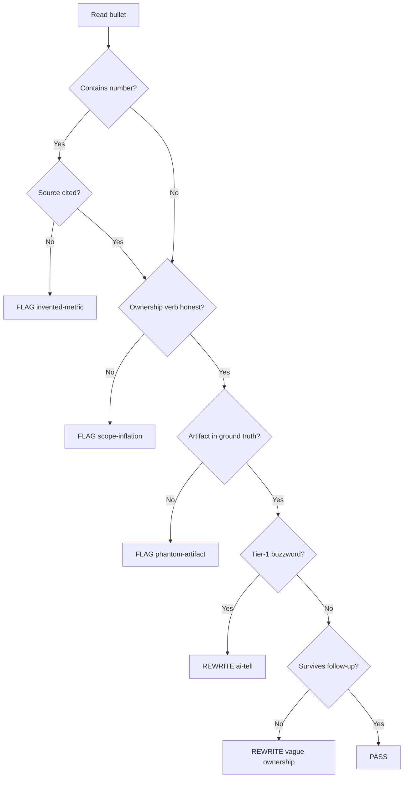

# Credibility Decision Tree

Text flowchart for bullet-level decisions. Use during Step 2 (Credibility) before rewriting.

```
START: Read one bullet
│
├─ Does it contain a number (% / $ / count / x)?
│   ├─ YES → Can candidate cite source in 10 seconds?
│   │         ├─ YES → KEEP number (verify wording matches source)
│   │         └─ NO  → DROP number OR rewrite without metric → FLAG: invented-metric
│   └─ NO  → Continue
│
├─ Does it use Led / Owned / Architected / Spearheaded?
│   ├─ YES → Does ground truth support ownership verb?
│   │         ├─ YES → KEEP verb
│   │         └─ NO  → DOWNGRADE verb (Contributed to / Implemented / Co-led) → FLAG: scope-inflation
│   └─ NO  → Continue
│
├─ Does it name a project, system, or tool?
│   ├─ YES → Does that artifact appear in ground truth?
│   │         ├─ YES → KEEP
│   │         └─ NO  → DELETE bullet or rewrite to real artifact → FLAG: phantom-artifact
│   └─ NO  → Continue
│
├─ Does it contain Tier-1 buzzword? (passionate, proven track record, dynamic, leverage...)
│   ├─ YES → REWRITE using [red-flag-phrases.md](../phrase-libraries/red-flag-phrases.md) → FLAG: ai-tell
│   └─ NO  → Continue
│
├─ Can recruiter ask ONE specific follow-up and get an answer?
│   ├─ YES → PASS bullet (apply H4 rhythm check at group level)
│   └─ NO  → REWRITE to name artifact OR DELETE → FLAG: vague-ownership
│
END
```

---

## Group-level checks (after all bullets)

```
All bullets processed?
│
├─ Any two bullets start with same word?
│   └─ YES → REWRITE one lead word → FLAG: symmetric-rhythm
│
├─ All bullets within ±2 words length?
│   └─ YES → Shorten one, lengthen one → FLAG: ai-rhythm
│
├─ Credibility flags on page 1?
│   ├─ invented-metric OR phantom-artifact → VERDICT: Block
│   ├─ scope-inflation only → VERDICT: Fix first
│   └─ ai-tell / vague-ownership only → VERDICT: Rewrite then re-score
│
END → Apply [aggregate-formula.md](../scoring/aggregate-formula.md)
```

---

## Mermaid version (for docs/tools)



---

## See also

- [12 credibility heuristics](credibility-heuristics.md)
- [Scoring rubric](../scoring/scoring-rubric.md)
- [Audit template](../audits/audit-template.md)
